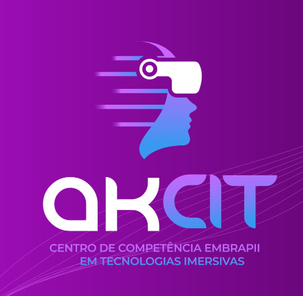

  

O [AKCIT](https://akcit.ufg.br/) está associado ao Centro de Excelência em Inteligência Artificial (CEIA), que é a maior referência latino americana para Inteligência Artificial (IA) e a Unidade Embrapii com melhor nota de avaliação das empresas.

---

# Áreas de Expertise

Nosso time de especialistas renomados domina as seguintes áreas-chave:

- **Inteligência Artificial (IA):**

  Deep Learning, Machine Learning, IA Generativa, Processamento de Linguagem Natural e Visão Computacional.

- **Realidade Virtual (VR) e Realidade Aumentada (AR):**

  Simulação de Ambientes, Modelagem 3D, Interação Homem-Máquina e Renderização em Tempo Real.

- **Gêmeos Digitais:**

  Modelagem e Simulação de Processos, Integração de Dados, Otimização e Simulação de Cenários.

- **Internet das Coisas (IoT) e Computação de Borda:**

  Sensoriamento Inteligente, Coleta e Processamento de Dados e Aplicações Distribuídas.

---

# Frentes de Atuação

- **Projetos de PD&I em Tecnologias Imersivas**  
  Soluções de inovação para desafios específicos da indústria.

- **Formação e Capacitação em Tecnologias Imersivas**  
  Programas de pós-graduação lato sensu, cursos de curta duração e bootcamps.

- **Apoio à Criação e Aceleração de Startups**  
  Mentorias para acesso a investimentos por meio de chamadas públicas.

- **Infraestrutura**  
  Laboratório avançado de realidade virtual e realidade aumentada, equipado com tecnologias de ponta para o desenvolvimento de soluções imersivas.

---

# Por que escolher o AKCIT?

O AKCIT está associado ao Centro de Excelência em Inteligência Artificial (CEIA), que é a maior referência latino americana para Inteligência Artificial (IA) e a Unidade Embrapii com melhor nota de avaliação das empresas.

O CEIA é o pioneiro na formação de recursos humanos no tema de IA, atingindo a marca de R$ 200 milhões investidos com empresas de variados segmentos e possui mais de 60 projetos de inovação executados.

---

# Reconhecimento Internacional

O AKCIT é o primeiro grupo de pesquisa da América Latina reconhecido pela NVIDIA Inc. no programa "AI Nations", que destaca grupos de pesquisa que impulsionam o ecossistema de IA global.

---

# Fale Conosco

contato.akcit@ufg.br
